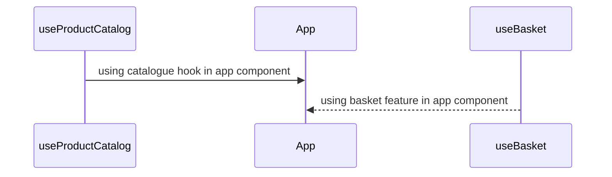
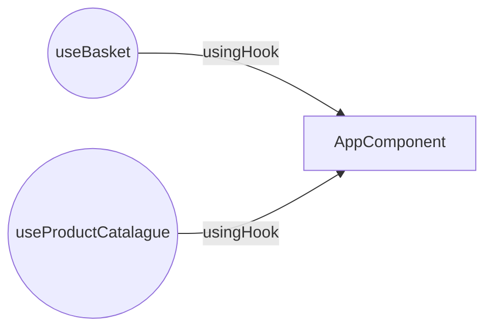

# Plates Co.

A simple [react](https://reactjs.org/) application using [tailwindcss](https://tailwindcss.com/) for design purpose.

 
### Folder Structure

```

\public
\src
	\component
	\kit
	index.js
	ProductCard.js
	\hooks
		useBasket.js
		useProductCatalogue.js
	\utility
		util.js
App.js
..
..
..
README.md
```

  

## Custom Hooks

### useProductCatalogue

> products => list of products
> addProduct => a function which add new product
> initProducts => initialize all predifined products currentyly "HARD CODE"
> removeProduct = remove product if needed
### useBasket
> basket    => state variable
> onClear  => function to clear basket
> getTotalPrice => calcluate the total price of an order
> sumWithOfferOn => caculate sum with offer
> applyDeliveryCharges => appy delivery charges based on rules, currently the rules are hardCoded
> addToBasket => add new item to basket

## Component & Hook diagrams



And this will produce a flow chart:

