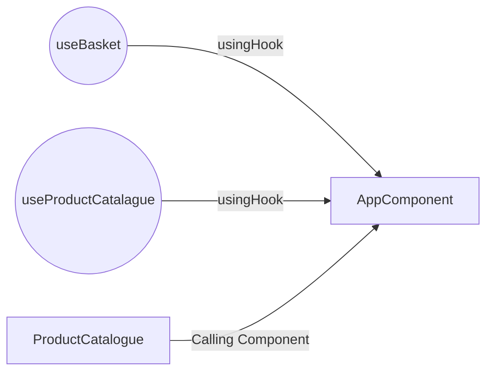

# Plates Co.

A simple [react](https://reactjs.org/) application using [tailwindcss](https://tailwindcss.com/) for design purpose.


### Instalation after cloning Repo
```
npm install
```

### Run Test
```
npm run test

 PASS  src/App.test.js
  √ It should render App component (30 ms)
  √ Basket: B01, B01 = $37.85 (14 ms)
  √ Basket: R01, R01 = $54.37 (9 ms)
  √ Basket: R01, G01 = $60.85 (11 ms)
  √ Basket: B01, B01, R01, R01, R01 = $98.27 (13 ms)

Test Suites: 1 passed, 1 total
Tests:       5 passed, 5 total
Snapshots:   0 total
Time:        0.565 s, estimated 1 s
Ran all test suites related to changed files.
```

### Folder Structure

```

\public
\src
	\component
	\kit
	index.js
	ProductCard.js
	\hooks
		useBasket.js
		useProductCatalogue.js
	\utility
		util.js
App.js
..
..
..
README.md
```

## Custom Hooks

### useProductCatalogue

```
return {
    products, // array:  list of products
    addProduct, // function:  add new product if needed
    initProducts, // function: initialise all products pre populated(HARD CODED)
    removeProduct, // function: remove product if needed
};
```

### useBasket

```
return {
    basket, // array: list of items
    onClear, // function: to clear basket
    getTotalPrice, // function: calculate total price
    sumWithOfferOn, // function: sum products with offer
    applyDeliveryCharges, // function: apply delivery charges on total,  based on rules, currently the rules are hardCoded
    addToBasket, // function: add new item to basket
   };
```

Components and Hooks Daigram:


